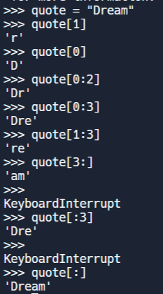

# Python
## Fundamentals
### Hello World Program
```python
print("Hello, World!!")
```

### Declare and Assign, type() operator
```python
name = "Sanjana"
print(name)
print (type(name))
```
```python
age = 20
print(type(age))
```
### Concat: String
```python
print("My name is "+name)
```
### Getting value from User
```python
name1 = input("Enter your name:")
print("My name is "+name1)
```
#### Task 1: Fahrenheit to Celsius
```python
F = input("Enter temperature:")
print(type(F))
C = ((float(F)-32)*5)/9
print(C, type(C))
print("The equivalent of "+str(F)+"°F is "+str(C)+"°C")
```

### Uses of fString
<ol>
<li>
To print a statement without the need of TypeCasting
</li>
<li>
To print an expression
</li>
</ol>

### Using fString function in Task 1
```python
F = input("Enter temperature:")
print(type(F))
C = ((float(F)-32)*5)/9
print(C, type(C))
print(f"The equivalent of {F}°F is {C}°C")
```

### fString can print an expression
```python
by = input("Enter birth year: ")
age = 2024 - int(by)
print(f"Your age is {2024-int(by)}")
```

### Benefits of using fString
<ol>
<li>
Readability improves
</li>
<li>
No need for Type Casting
</li>
</ol>

#### Task 2: Find the age of the person given the birth year 2000
```python
name = "Sanjana"
y = input("Enter your birth year: ")
age = 2024 - int(y)
print(f"Hello, {name}! You are {age} years old.")
```

### String * 2: (*) can repeat the string and also used with numbes to perform multiplication
```python
print("Hello"*2)
```

### 7**2: 7 to the power of 2
```python
print(7**2)
```

#### Task 3: Print area of the circle f string
```python
radius = input("Enter radius of circle: ")
area = 3.14*float(radius)**2
print(f"Area of the circle is {area}")
```

### Rules for Variables
<ol>
<li>Cannot have special signs(@, !, &, space etc) except _</li>
<li>
Cannot start with number
</li> 
<li>
Cannot have keywords
</li>
</ol>

#### Task 4: Build a loader Input: 23 Output: [==          ]
```python
n = input("Enter loading percentage: ")
p = int(n)//10;
print(f"[{'='*p}{' '*(10-p)}]")
```

## Conditional Statements
Indentation matters 
### Operators which result into boolean values
<ol>
<li> Relational Operators: >, <, >=, <=, ==, !=
</li>
<li>
Logical Operators: and, or, not
</li>
</ol>

### if always expects a boolean value

#### Task 1: Get name and height from 2 users and compare their height and state taller one
```python
name1 = input("Enter name for Person 1:")
h1 = input("Enter height for Person1: ")
name2 = input("Enter name for Person 1:")
h2 = input("Enter height for Person1: ")

#Logical Error: if we directly write h1 > h2
if(int(h1) > int(h2)):
  print(f"{name1} is taller than {name2}")
elif(int(h1) == int(h2)):
  print(f"{name1} is equal to {name2}")
else:
  print(f"{name2} is taller than {name1}")
```

### Lexical Comparison
The string datatype is compared character by character not as a number
```python
'174' > '11111' - True
174>11111 - False
'abc' > 'def' - False
```

#### Task 2: Mention 3 ice cream flavours and ask their favourite flavour and if we have a flavour in stock we say "Yes, we do have it" or else "No, we ran out of stock"
```python
stock1 = "vanilla"
stock2 = "lime"
stock3 = "chocolate"
flavour = input("Enter your favourite flavour: ")
if(stock1==flavour or stock2==flavour or stock3 == flavour):
  print(f"Yes, we do have {flavour} flavour")
else:
  print("No, we ran out of stock")
```

### in() -> Membership Operator
```python
stock = "vanilla, lime, chocolate"
flavour = input("Enter your favourite flavour: ")
if(flavour in stock):
  print(f"Yes, we do have {flavour} flavour")
else:
  print("No, we ran out of stock")
```

### Unary Operator
<ol>
<li>not operator</li>
</ol>

### Binary Operator
<ol>
<li>Relational Operators</li>
<li>Arithmetic Operators</li>
<li>Comparison Operators</li>
<li>Logical Operators: and, or</li>
</ol>

### Ternary Operator 
Ternary Operator consists of 3 operands 1 input and 2 outputs
```python
# <Yes> if <condition> else <No>
stock = "vanilla, lime, chocolate"
flavour = input("Enter your favourite flavour: ")
output = "Yes, we do have it" if flavour in stock else "No, we ran out of stock"
print (output)
```

### 5 Pillars of Code Quality
<ol>
<li>Code Readability - Code can be read easily by ourselves and </li>
<li>Maintainability - Breaking down code into smaller parts</li>
<li>Extendibility -  allows developers to add new code to a platform without changing the existing code.</li>
<li>Testibility - Should be easily testible </li>
<li>Performance</li>
</ol>

### Code Debt
Tomorrow I will make code better but tomorrow never comes code reusability reduces code debt.


## String Functions
### Case Methods
```python
msg = "Hi, all"
print(msg.upper())
print(msg.lower())
print(msg.title())
print(msg.capitalize())
```

### Formatting Methods

```python
quote = "      Dream is not something that you see in sleep, Dream is something that does not let you sleep"
print(quote)
print(quote.strip())
```

```python
quote1 = "----Dream is not something-that you see in sleep, Dream is something that does not let you sleep----"
print(quote1.strip("-"))
print(quote1.lstrip("-"))
print(quote1.rstrip("-"))
```

### find and replace

find - Returns the index of the first match
and if does not match it returs -1
```python
quote3 = "Dream is not something-that you see in sleep, Dream is something that does not let you sleep."
#Returns index of first match
print(quote3.find('something'))
#0
print(quote3.find('Dream'))
#-1: not present
print(quote3.find('**'))
```

Strings are immutable - we cannot change the string using replace method
```python
print(quote3.replace("Dream","🛌"))
print(quote3)
```
The above String can be changed by writing the following code i.e. reassigning
```python
quote3 = print(quote3.replace("Dream","🛌"))
print(quote3)
```

### Slicing
Allows you to extract a subset of elements from a sequence<br><br>


#### Task 1 : 
After the 🔑<br>
message = "    🚨🔍📱🔑secret_code✌️"<br>
code = "SECRET_CODE✌️"<br>
output = # Your code<br>
if (output == code):<br>
  print("You are an hacker 🎊")<br>
else:<br>
  print("Try again")<br>
 Output<br>
 "You are an hacker"<br>
 or<br>
 "Try again"<br>

```python

```
(In day 9)


